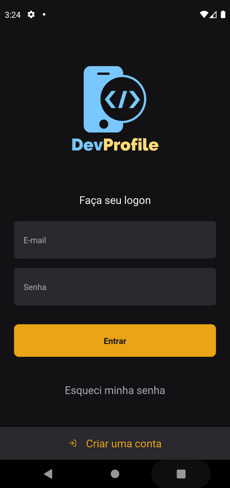
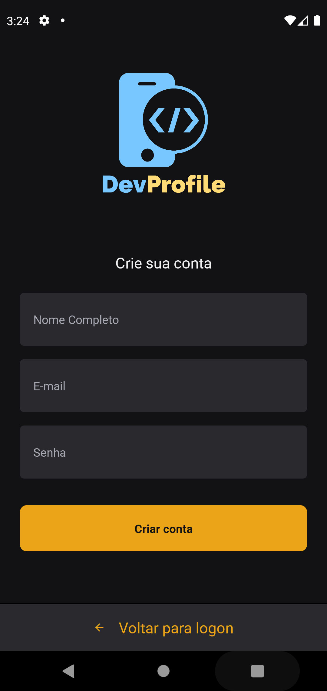
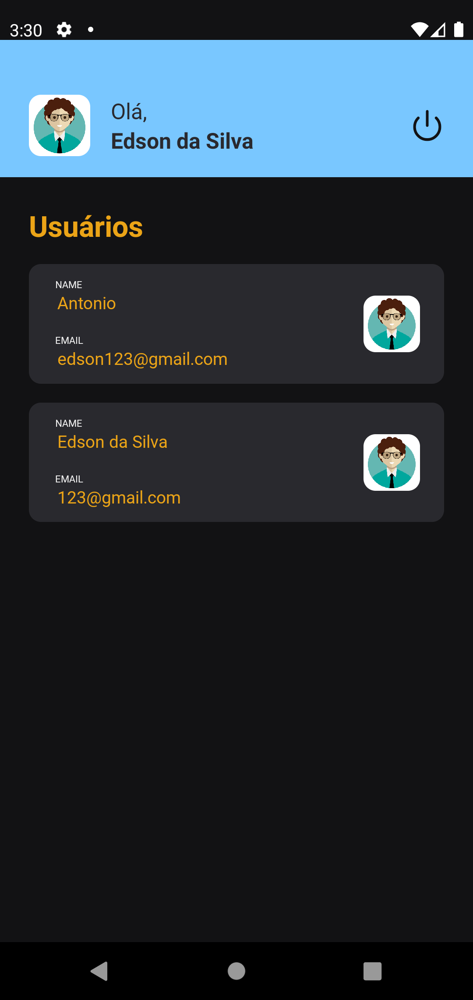
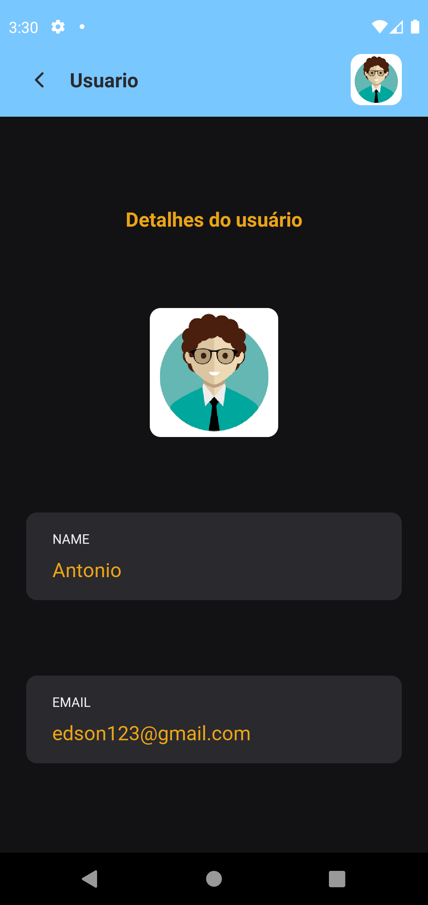
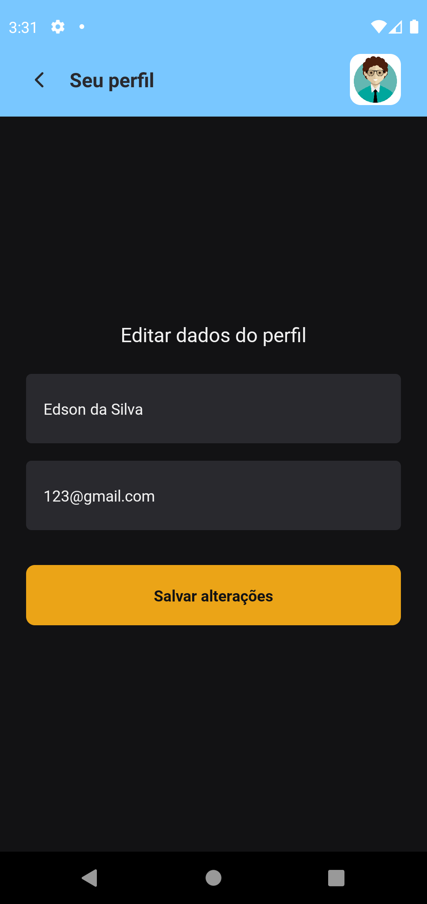

# DevProfile
App DevProfile (React Native e TypeScript)

<p align="center">

</p>

# Screenshots
<p align="center">
  
  
  
</p>

<p align="center">
  
  
   
</p>

## 💻:iphone:Tecnologias utilizadas 

- `React Native`
- `TypeScript`
- `Expo`
- `Async-storage`
- `Axios`
- `Styled-components`
- `React-hook-form`
---

### Clonar o repositório e instalar as dependências
> :warning: O App está consumindo uma api em nodejs, é necessário clonar e executar a api. [Link da Api e documentação](https://github.com/aluiziodeveloper/api-node-devprofile) 

```
$ git clone https://github.com/eds9nsilva/DevProfile.git
```
```
cd DevProfile
```
##### Instalando as depedências
```
yarn ou npm install
```

> Executando. Você precisa do emulador instalado ou celular conectado via USB em modo desenvolverdor. :warning:
```
expo start
```
---
Made with ☕ by Edson da Silva
